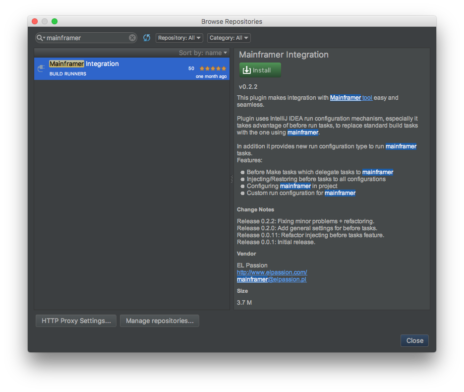
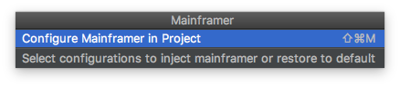
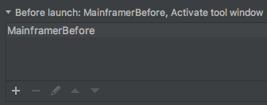
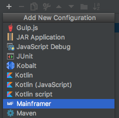
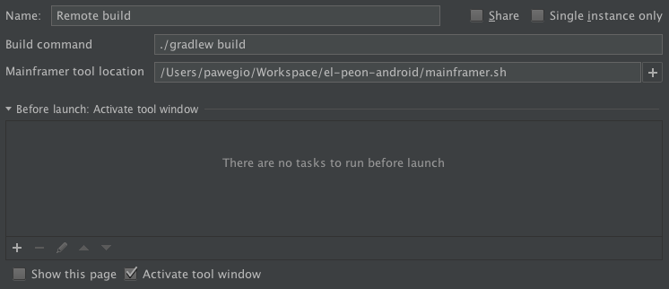

# mainframer-intellij-plugin    
An IntelliJ IDEA plugin for [Mainframer](https://github.com/gojuno/mainframer).

About
-----

This plugin makes integration with Mainframer tool easy and seamless. Plugin uses IntelliJ IDEA run configuration mechanism, especially it takes advantage of before run tasks, to replace standard build tasks with the one using mainframer. In addition it provides new runConfiguration to run mainframer tasks.

#### Features
* BeforeTasks which delegate tasks to mainframer
* Injecting/Restoring before tasks to all configurations
* Configuring mainframer in project
* RunConfiguration for mainframer

Installation
------------

1. Open plugins window (with proper action or through *Preferences > Plugins*).
2. Find **mainframer-plugin** in JetBrains plugins repository.
3. Install plugin and restart IDE to apply changes.

**Alternative way:**

If you want to install a specific version of the plugin visit [mainframer-plugin website](https://plugins.jetbrains.com/idea/plugin/9447-mainframer-plugin), download zip file and click *Install plugin from disk...* providing path to it.

Setup
-----

Before you can start using **mainframer-plugin** you must configure your [remote machine](https://github.com/gojuno/mainframer/blob/development/docs/SETUP_REMOTE.md) and [local machine](https://github.com/gojuno/mainframer/blob/development/docs/SETUP_LOCAL.md) (omitting last *Configuration* section, because the plugin will do it for you).

Usage
-----

### Actions

Launch *Enter action dialog* with (<kbd>command</kbd> or <kbd>ctrl</kbd>) + <kbd>shift</kbd> + <kbd>A</kbd> and find *Mainframer* action. Then press *Enter* to show group of all actions available with plugin:

#### Configure Mainframer in Project

This is an initial action you need to perform to configure Mainframer in your current project. It starts with fetching a list of all available tool releases. You can select a Mainframer tool version you are interested in. It will check if your opened project contains a *mainframer.sh* file and if not it will download it for you.

#### Inject mainframer before run task

With this action plugin will modify all your created run configurations. For each configuration it will remove default *before launch* task and inject **MainframerBefore** task:

#### Restore default before run tasks

Whenever you decide to build your project locally, this action will restore default *before run* tasks in all run configurations defined.

### Run configurations

You can use **mainframer-plugin** either to inject predefined *before launch* tasks or to create a custom run configuration. In case to add new mainframer configuration open run configurations dialog, click add button and select proper configuration type as below:

For created configuration you can set a build command and tasks to execute:

Now you are ready to run your custom mainframer configuration:

License
-------

    Copyright 2017 EL Passion

    Licensed under the Apache License, Version 2.0 (the "License");
    you may not use this file except in compliance with the License.
    You may obtain a copy of the License at

       http://www.apache.org/licenses/LICENSE-2.0

    Unless required by applicable law or agreed to in writing, software
    distributed under the License is distributed on an "AS IS" BASIS,
    WITHOUT WARRANTIES OR CONDITIONS OF ANY KIND, either express or implied.
    See the License for the specific language governing permissions and
    limitations under the License.