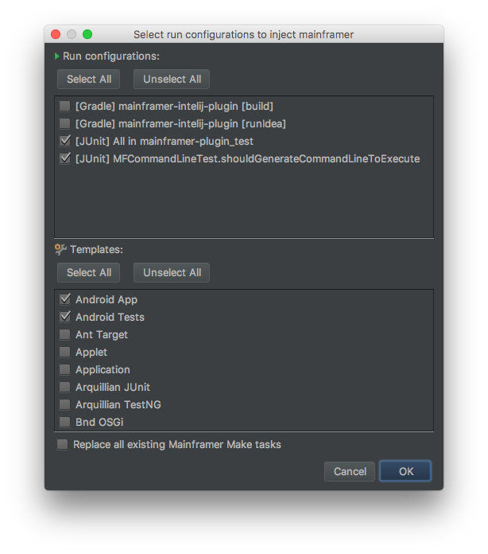
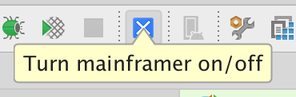

# Mainframer Integration  
An IntelliJ IDEA plugin for [Mainframer](https://github.com/gojuno/mainframer).

About
-----

This plugin makes integration with Mainframer tool easy and seamless. Plugin uses IntelliJ IDEA run configuration mechanism, especially it takes advantage of before run tasks, to replace standard build tasks with the one using mainframer. In addition it provides new run configuration type to run mainframer tasks.

#### Features
* Mainframer Make tasks which delegate tasks to mainframer
* Injecting/Restoring before tasks to all configurations
* Configuring mainframer in project
* Custom run configuration for mainframer
* Switching between local and remote compilation
* Support for Intellij idea macros

Installation
------------

1. Open plugins window (with proper action or through *Preferences > Plugins*).
2. Find **Mainframer Integration** in JetBrains plugins repository.
3. Install plugin and restart IDE to apply changes.

**Alternative way:**

If you want to install a specific version of the plugin visit [Mainframer Integration website](https://plugins.jetbrains.com/plugin/9603-mainframer-integration), download zip file and click *Install plugin from disk...* providing path to it.

**:warning: Nightly builds:**

If you prefer to follow latest features of **Mainframer Integration** plugin (being under development), you can switch to nightly channel. However, keep in mind that these versions are not stable so you can encounter some unexpected bugs. To make a switch follow these steps: 

1. Inside plugins window click *Browse repositories...*
2. In the next window click *Manage repositories...*
3. Click :heavy_plus_sign: icon.
4. Paste a repository URL: `https://plugins.jetbrains.com/plugins/nightly/9603`
5. Confirm and browse **Mainframer Integration** again to install nightly version.

When you decide to return to stable channel simply delete provided repository URL.

Setup
-----

Before you can start using **Mainframer Integration** plugin you must configure your [remote machine](https://github.com/gojuno/mainframer/blob/development/docs/SETUP_REMOTE.md) and [local machine](https://github.com/gojuno/mainframer/blob/development/docs/SETUP_LOCAL.md) (omitting last *Configuration* section, because the plugin will do it for you).

Usage
-----

### Actions

Launch *Enter action dialog* with (<kbd>command</kbd> or <kbd>ctrl</kbd>) + <kbd>shift</kbd> + <kbd>A</kbd> and find *Mainframer* action. Then press *Enter* to show group of all actions available with plugin:

#### Configure Mainframer in Project

This is an initial action you need to perform to configure Mainframer in your current project. It starts with fetching a list of all available tool releases. You can select a Mainframer tool version you are interested in. It will check if your opened project contains a *mainframer.sh* file and if not it will download it for you.

#### Select configurations to inject mainframer or restore to default

This action comes with a dialog containing selectable lists of run/debug configurations and default configurations (templates):

After clicking *OK* button plugin will modify all your created run configurations. For each selected configuration it will remove default *before launch* task and inject **Mainframer Make** task. 

Simultaneously, for each unselected configuration, this action will restore default *before run* task, enabling project local build.

Selecting a checkbox at the bottom of the dialog indicates that you want to override all **Mainframer Make** tasks properties, set separately per run configuration, with defaults from plugin settings (defined in *Tools > Mainframer*).

### Switching between local and remote compilation

Just press the blue button:

### Run configurations

You can use **Mainframer Integration** plugin either to inject predefined *before launch* tasks or to create a custom run configuration. In case to add new mainframer configuration open run configurations dialog, click add button and select proper configuration type as below:

For created configuration you can set a build command to execute:

Now you are ready to run your custom mainframer configuration:

License
-------

    Copyright 2017-2019 EL Passion

    Licensed under the Apache License, Version 2.0 (the "License");
    you may not use this file except in compliance with the License.
    You may obtain a copy of the License at

       http://www.apache.org/licenses/LICENSE-2.0

    Unless required by applicable law or agreed to in writing, software
    distributed under the License is distributed on an "AS IS" BASIS,
    WITHOUT WARRANTIES OR CONDITIONS OF ANY KIND, either express or implied.
    See the License for the specific language governing permissions and
    limitations under the License.
